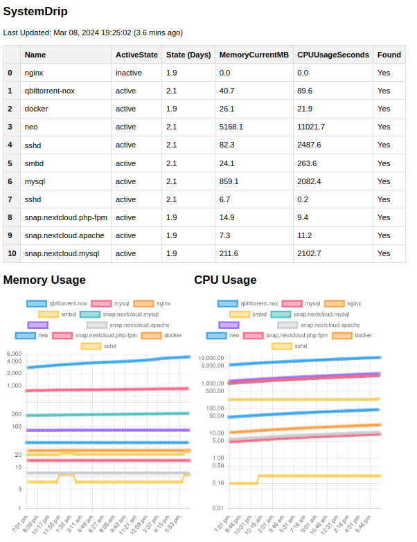

# SystemDrip

This program lets you monitor systemd service states via cli and/or a browser in the **simplest** way possible.

## Usage

Running `python3 systemdrip.py` will output all the configured service states likeso,

```
              Name Found ActiveState  State (Days)  MemoryCurrentMB  CPUUsageSeconds
0            nginx   Yes      active           2.3             10.0              0.0
1  qbittorrent-nox   Yes      active           4.2             12.0            177.5
2           docker   Yes      active           5.8            101.9             77.5
3              neo   Yes      active           2.2           1715.8          13791.9
4     non_existent     -           0           0.0              0.0              0.0
```

It will also generate a .html file for serving via HTTP.

Here is a cron entry to run this every 5 minutes.

`*/5 * * * * python3 /path/to/systemdrip.py > /path/to/cron.log 2>&1`

Now to serve this data via HTTP, you can run `python3 server.py` (below I include a sample unit file to run this).



## Configuration

Configure the file `config.json` with the following,

- `services`: any service you want to monitor
- `properties`: any systemd properties you're interested in. View existing properties and their values for a given service with `sudo systemctl show <service_name>`.
- `pid_properties`: supports `%mem` and `%cpu`.
- `final_column_order`: the columns you want the output table to have, in order.
- `host`, `port`, and `debug` are all Flask server configs.
- `persist_metrics`: save metrics to a SQLite database?
- `persist_metrics_days`: number of days to keep metrics before deletion.
- `chartjs`: use chartjs to plot data?
- `plot_nth_points`: only plot every nth point.
- `plot_n_days`: only plot n days into the past.
- `plot_n_points_per_service`: limit the number of plot points to n points per service.

<details>
<summary>If you want to run the server as a service, here is a unit file.</summary>

```
[Unit]
Description=SystemDrip
After=network-online.target

[Service]
Type=simple
WorkingDirectory=/home/USERNAME/systemdrip
Environment="PYTHONPATH=$PYTHONPATH"
ExecStart=python3 server.py
User=USERNAME
Restart=always
RestartSec=300
SyslogIdentifier=systemdrip

[Install]
WantedBy=multi-user.target
```

Supplementary commands for running the service,

- `sudo cat /etc/systemd/system/systemdrip.service`
- `sudo systemctl enable systemdrip`
- `sudo systemctl start systemdrip`
- `sudo systemctl status systemdrip`
</details>

## Dependencies

- The only non-standard libraries can be installed with `sudo pip install pandas flask`. `sudo` is important to use for the cron job.


## Why

I didn't like any of the traditional monitoring solutions because they made things too complicated. I just wanted something simple to see what state any given service was in, and for how long. Accomplishing this shouldn't require more than 150M of code, or more than 5 minutes of learning. Flask is 728K. Pandas is 62M and might get replaced with some utility functions in the future to remove it as a dependency. The usage section of this document can easily be read in under 5 minutes.

|Project|Thoughts|
|---|---|
| https://github.com/prometheus/prometheus | Requires a custom exporter to gather systemd metrics, and over 250M. |
| https://github.com/prometheus-community/systemd_exporter | Doesn't gather all the systemd parameters I wanted and also outputs states as integers. |
| https://github.com/ncabatoff/process-exporter | Details are too fine grain for service level metrics. |
| https://github.com/prometheus/node_exporter | Would require a text_collector fed by a custom bash script that gathers systemd service states. |
| https://github.com/influxdata/telegraf | The binary is over 150M, configuration takes too much time to understand, it requires a plugin, and it does too many things. |
| https://github.com/grafana/grafana | Too complex, and over 390M. |
| https://github.com/ratibor78/srvstatus | This parsed the output from `systemctl status`, rather than `systemctl show --property`. |
| https://github.com/zzndb/srvstatus | Uses the above project. |
